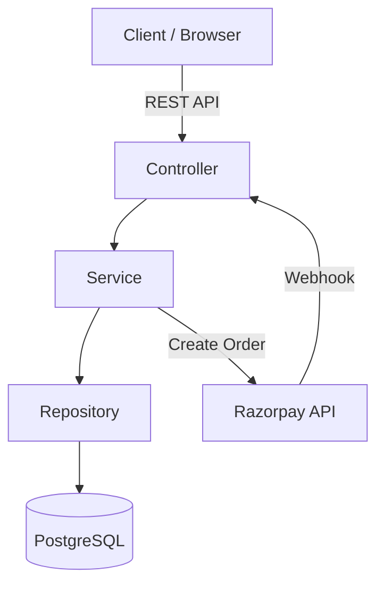
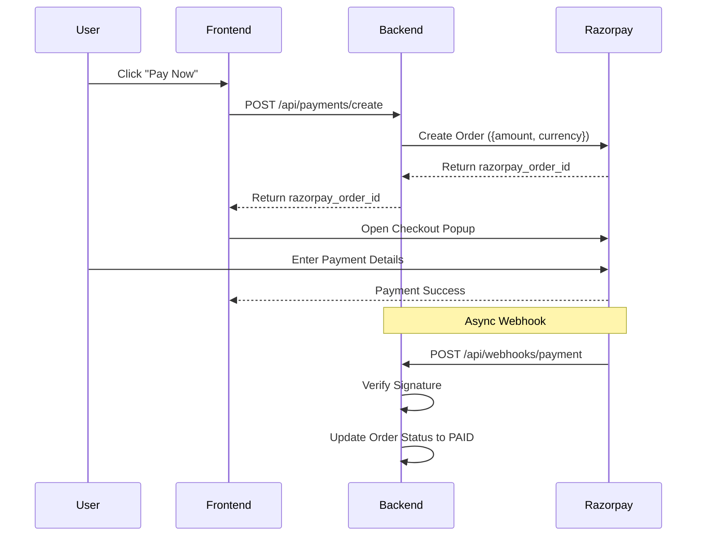

# E-Commerce Backend API

This is a Spring Boot backend for an e-commerce application. It includes Product, Cart, Order management, and Razorpay payment integration.

## Architecture

## Payment Flow

## Prerequisites

- Java 21
- PostgreSQL
- Maven

## Setup

1. Create a PostgreSQL database named `ecommerce_db`.

2. Create a file named `.env` in the root folder with the following details:

   DB_PASSWORD=your_database_password
   RAZORPAY_KEY_ID=your_key_id
   RAZORPAY_KEY_SECRET=your_key_secret
   RAZORPAY_WEBHOOK_SECRET=your_webhook_secret

3. Run the application:

   mvn spring-boot:run

The server will start at http://localhost:8080.

## API Endpoints

### Products
- POST /api/products - Create product
- GET /api/products - List products

### Cart
- POST /api/cart/add - Add to cart
- GET /api/cart/{userId} - View cart
- DELETE /api/cart/{userId}/clear - Clear cart

### Orders
- POST /api/orders - Create order
- GET /api/orders/{orderId} - View order

### Payments
- POST /api/payments/create - Create Razorpay order
- POST /api/webhooks/payment - Webhook for payment status

## Testing Payments

1. Start the app.
2. Create an order using Postman (POST /api/orders).
3. Open http://localhost:8080/checkout.html in your browser.
4. Enter the Order ID and pay.
